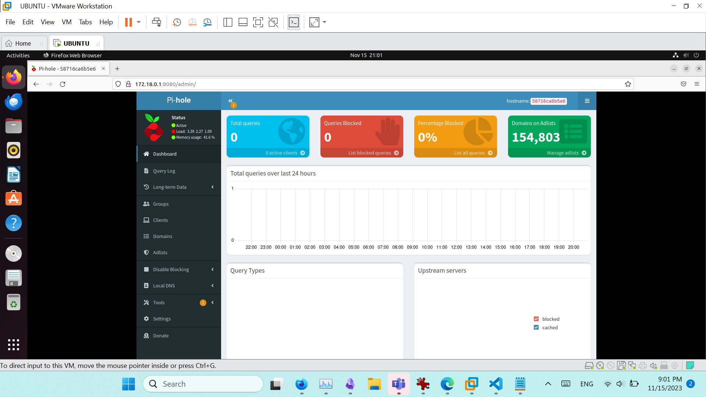

# Pi-Hole Installation Walkthrough
***


#### Table of Contents:
***
1. [Docker Installation](#docker_install)
2. [Pi-Hole Docker Container Installation](#pihole_container)
3. [Docker-Compose Configuration File](#docker_configure)
4. [Disable the Systemd-Resolve Service (For Ubuntu)](#systemd)
5. [Run the Pi-Hole Docker Container](#run)
6. [Pi-Hole Web Interface Access](#access)

#### Docker Installation <a name="docker_install"></a>
***
1. Update the packages
```
sudo apt update
```
2. Install Docker-Compose
```
sudo apt install docker-compose
```
#### Pi-Hole Docker Container Installation <a name="pihole_container"></a>
***
1. Create a Pi-Hole Directory
```
mkdir ~/pihole
```
```
cd ~/pihole
```
#### Docker-Compose Configuration File <a name="docker_configure"></a>
1. Create a yml for configuration.
```
nano docker-compose.yml
```
2. Fill in the yml file with the information below.Modify the lines with square brackets.
```
version: "3"

services:
  pihole:
    container_name: pihole
    image: pihole/pihole:latest
    ports:
      - "53.53/tcp"
      - "53:53/udp"
      - "67:67/udp"
        # You can change the number of the left side of ":".
        # Example: 8080:80
      - "80:80/tcp"
    environment:
      TZ: '[Time_Zone]' (Example: 'America/Chicago')
      WEBPASSWORD: '[Password]' (Example: 'password123')
    volumes:
      - './etc-pihole:/etc/pihole'
      - './etc-dnsmasq.d:/etc/dnsmasq.d'
    cap_add:
      - NET_ADMIN
    restart: unless-stopped
```
#### Disable the Systemd-Resolve Service (For Ubuntu Machine) <a name="systemd"></a>
1. Since the Systemd-Resolve Service utilizes the same area that the Pi-Hole needs, this service must first be disabled. 
```
sudo systemctl disable systemd-resolved
sudo systemctl stop systemd-resolved
```
2. Configure the resolv.conf file.
```
sudo nano /etc/resolv.conf
```
3. Replace nameserver 127.0.053 with:
```
nameserver 1.1.1.1
```
#### Run the Pi-Hole Docker Container <a name="run"></a>
1. Type in this command to run Pi-Hole.
```
sudo docker-compose up -d
```
#### Pi-Hole Web Interface Access <a name="access"></a>
1. Find your local IP.
```
hostname -I
```
2. Type in the following into the browser.
```
http://[INSERT_YOUR_IP_ADDRESS]/admin
```
If the port has been changed:
```
http://[IPADDRESS]:[PORT]/admin
```
#### Final View
***
Once the installation process is complete, you should see the view similar to here below:


#### Reference:
1. https://pimylifeup.com/pi-hole-docker/


      


